# Cleanify — System Workflow & Flowcharts

> Full workflow of the Cleanify admin + field app after the **Admin Panel v2**
> revision. Diagrams are [Mermaid](https://mermaid.js.org) — they render in
> GitHub, VS Code (with a Mermaid extension), and most Markdown viewers.

---

## 1. What was requested vs. what was built (C1–C9)

| # | Morning spec item | Status | Where it lives |
|---|-------------------|--------|----------------|
| **C1** | **Booking Desk** — merge Customers + Bookings + Schedule into one screen | ✅ Done | `/booking-desk` (tabs: New booking · All bookings · Customers · Pending scheduling) |
| **C2** | **Work Photos & Approvals** — job photos + approve/decline | ✅ Done | `/work-approvals` (tabs: Pending · Approved · Declined · All photos) |
| **C3** | **Super-Admin Calendar** — colour-coded, drawer, per-worker day | ✅ Done | `/calendar` |
| **C4** | **Time scheduling + assignment** — start time, duration, supervisor, conflicts, attendance | ✅ Done | Job edit + intake + scheduling service |
| **C5** | **Pre-work check** — machinery + uniform/mask photos, approval gate | ✅ Done | Worker job screen → submission → approvals |
| **C6** | **Notifications** — in-app bell + badges (web-push kept) | ✅ Done | Topbar bell (both roles) + sidebar badge |
| **C7** | **Mid-job reschedule** — editable schedule on active jobs, notify crew, audit | ✅ Done | Calendar drawer + job edit + audit log |
| **C8** | **Completion approval** — completion photos, approval gate | ✅ Done | Worker job screen → submission → approvals |
| **C9** | **Review & staff rating** — customer review + per-crew rating, closes job | ✅ Done | Reviews screen; closes job on capture |

**Decisions locked in:** supervisor = a technician designated *per job* (no new
login role); the photo-approval gate is **hard** (can't start without approved
pre-work, can't complete without approved completion); approvers = **admins +
the job's supervisor**.

> ⚠️ **Testing note:** everything compiles and the production build is green, but
> the end-to-end run against the spec has **not** been executed on the live
> (production) database yet — that's the one remaining step.

---

## 2. High-level architecture

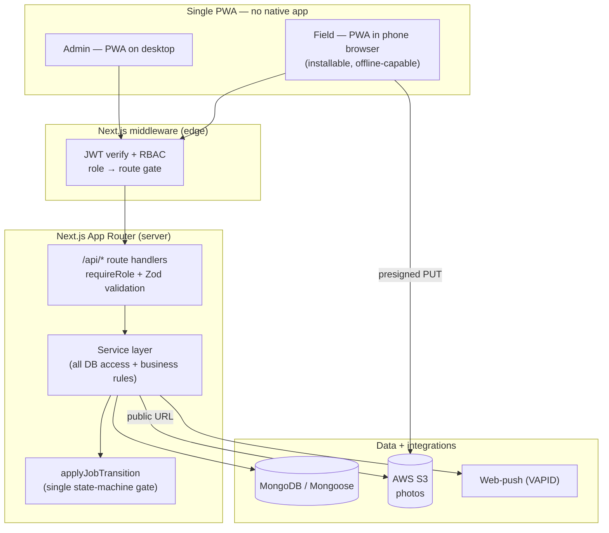

**Layers:** UI → middleware (auth + role gate) → API route (role re-check + Zod)
→ service (business logic, the only place that touches the DB) → models. Every
status change flows through `applyJobTransition` so the lifecycle has a single
enforcement point. Every meaningful action is written to the **audit log**.

> **One app, no native mobile app.** The whole system is a single installable
> **PWA** (Progressive Web App). The "field app" is the same website opened in a
> technician's **phone browser** — add-to-home-screen makes it feel app-like
> (home-screen icon, offline, push notifications), but there is no separate
> iOS/Android app to build or publish.

---

## 3. The job lifecycle — full state machine (C12)

This is the heart of v2. A job is **BOOKED**, gets **SCHEDULED**/assigned, then
runs through **two approval gates** (pre-work and completion) before it can be
**COMPLETED** and finally **CLOSED** after the review.

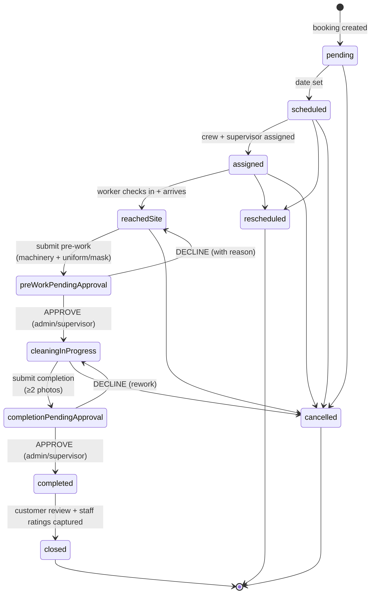

**Colour scheme on the calendar** (`statusMeta`): grey = scheduled · amber =
pre-work approval / on-site · blue = in progress · purple = completion approval ·
green = completed / closed · red = cancelled.

---

## 4. Booking Desk workflow (C1)

One screen replaces the old Customers → Bookings → Schedule hop. A booking
**always** spawns a Job automatically.

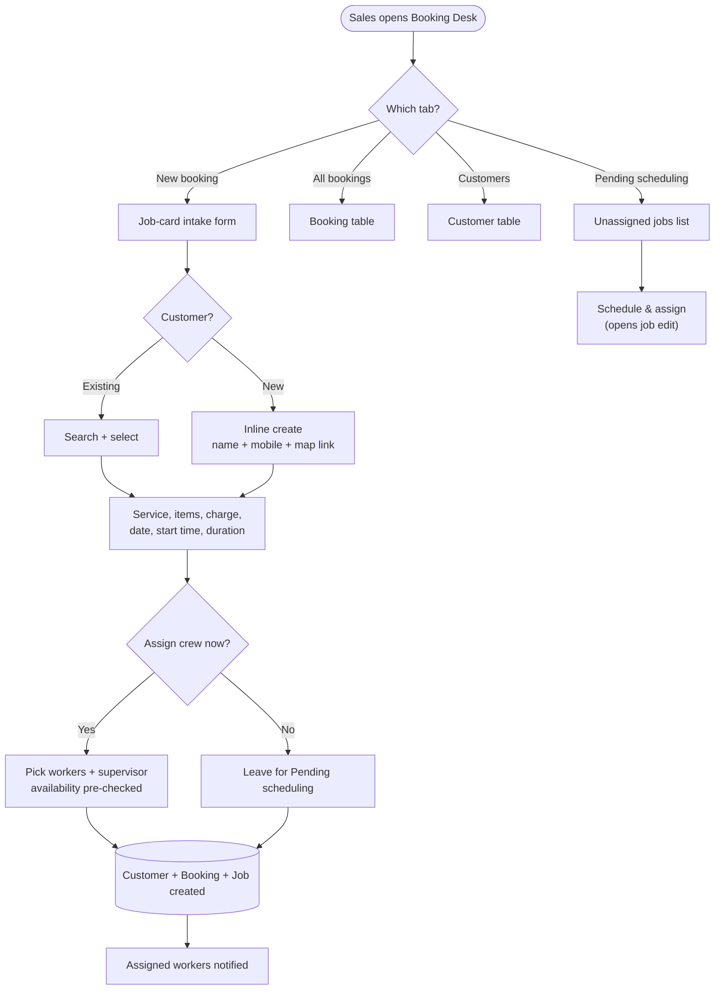

Every booking → job link is kept in sync: editing the booking propagates work
name, service, items, charge, map link, landmark and duration to the linked
non-terminal job.

---

## 5. Scheduling, assignment & the calendar (C3 + C4)

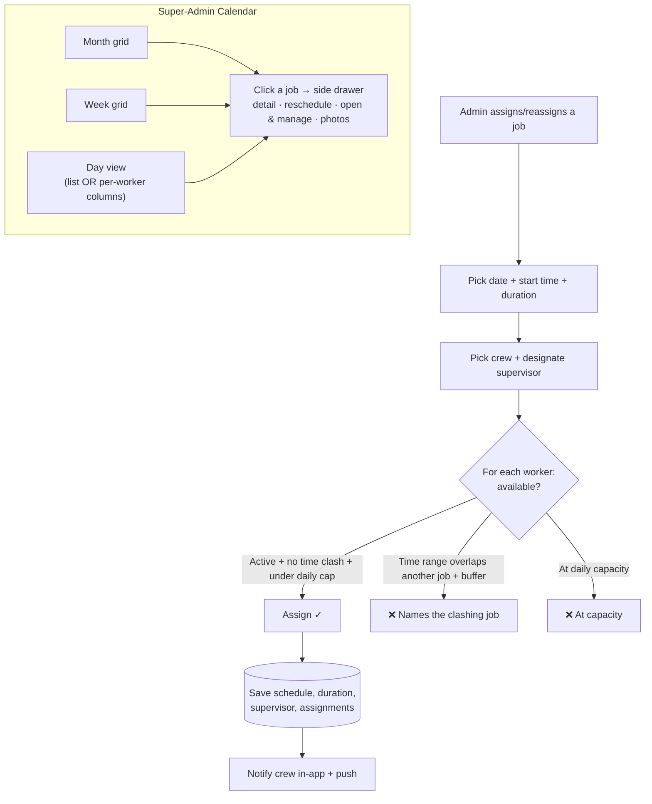

- **Conflict check** compares time *ranges* (`start → start+duration`) with a
  configurable **travel/setup buffer**, not just identical slots.
- **Attendance-aware:** each worker chip shows today's attendance (present /
  late / half-day / not checked in) so you don't assign an absent worker.
- **Durations** default per service type (editable per job).

---

## 6. Pre-work approval loop (C5) — the field ↔ office handshake

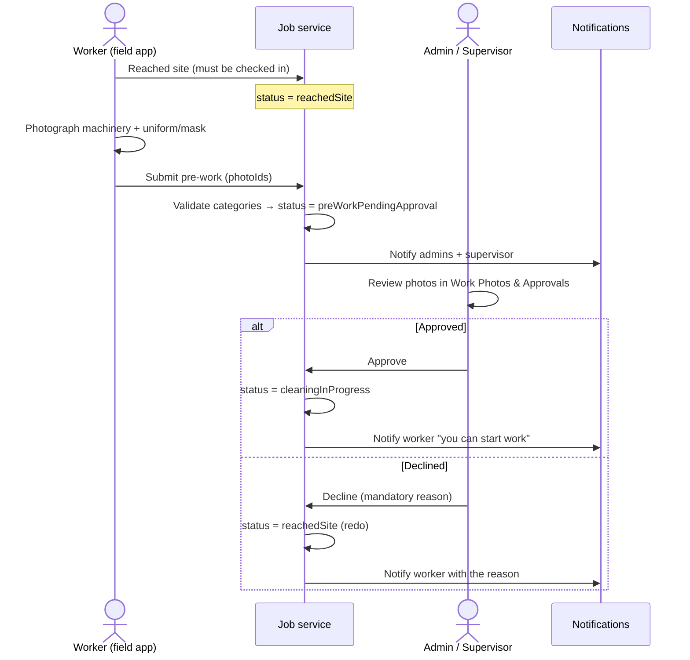

The worker **cannot start cleaning** until pre-work is approved — the "Start
work" path is blocked server-side.

---

## 7. Completion approval loop (C8)

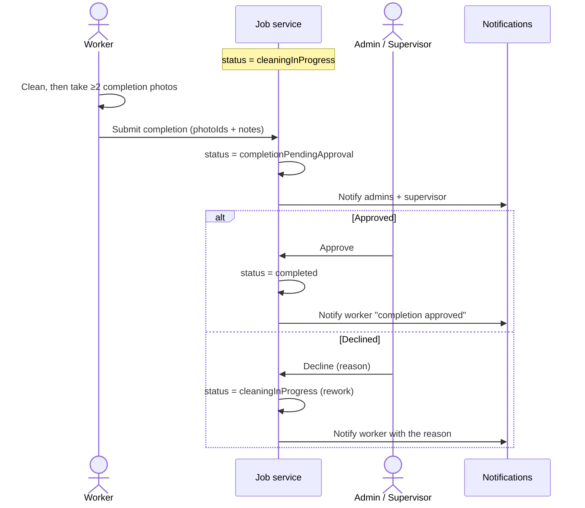

---

## 8. Review & close + staff rating (C9)

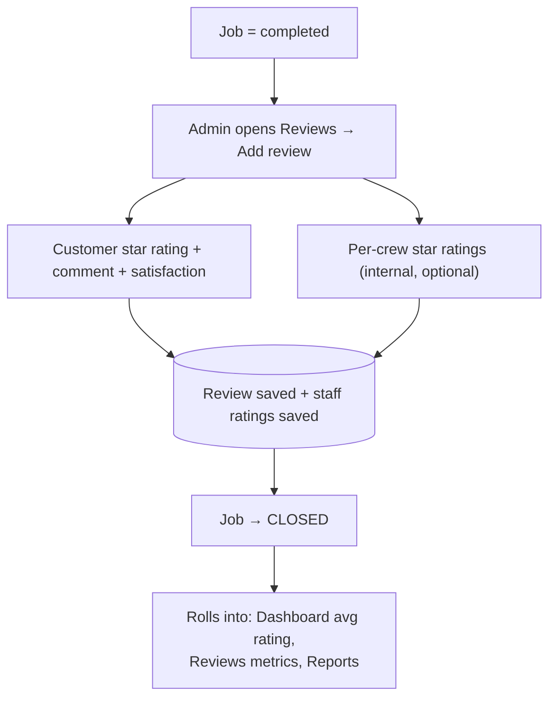

Capturing the customer review is what **closes** the job. Reports/dashboards
count both `completed` and `closed` as "done" so numbers never drop when a job
is closed.

---

## 9. Notifications (C6)

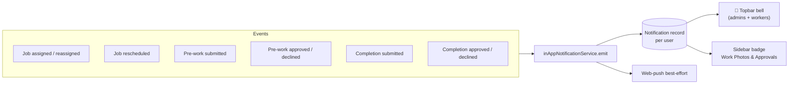

- **Workers** get: assigned / reassigned / rescheduled / approved / declined.
- **Admins + supervisor** get: pre-work & completion submitted (needs approval).
- Bell + badge poll about once a minute; clicking a notification opens the
  relevant screen and marks it read.

---

## 10. Roles & route map

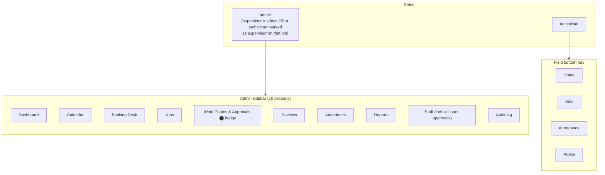

Old URLs still work: `/customers`, `/bookings` → Booking Desk tabs;
`/schedule` → `/calendar`; `/photos` → `/work-approvals`; `/approvals` →
Staff → Pending approvals.

---

## 11. Data model (key entities added / changed in v2)

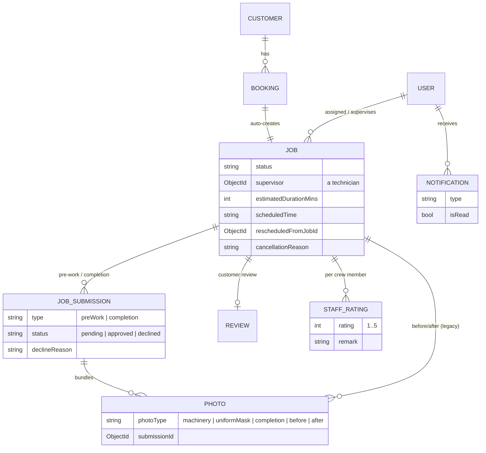

**New collections:** `JobSubmission`, `Notification`, `StaffRating`.
**Extended:** `Job` (supervisor, duration, reschedule/cancel fields),
`Booking` (duration), `Photo` (new categories + submission link),
`Review` (per-job, plus staff ratings alongside).

---

## 12. End-to-end happy path (one glance)

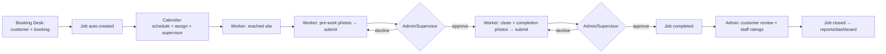

---

*Generated for the Cleanify B2B/ops handover. Contact:
cleanifycleaningservice88@gmail.com · 8848483892.*
